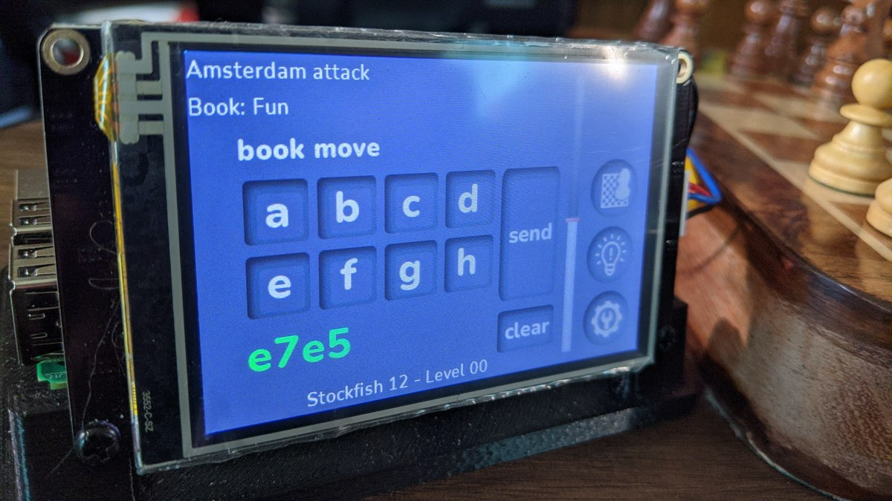
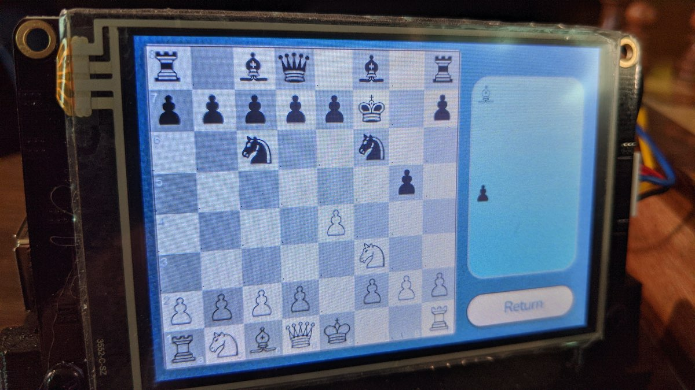
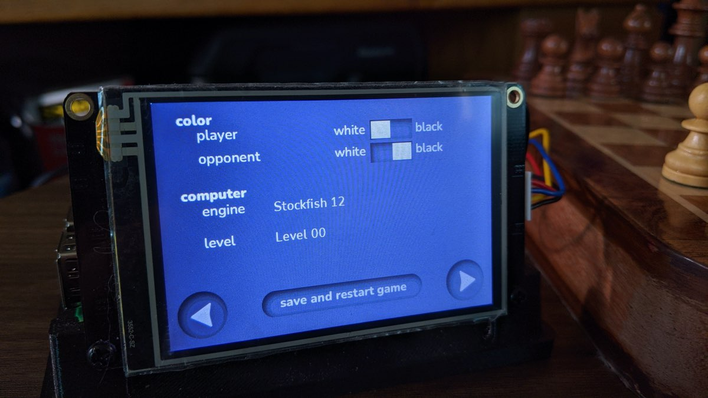
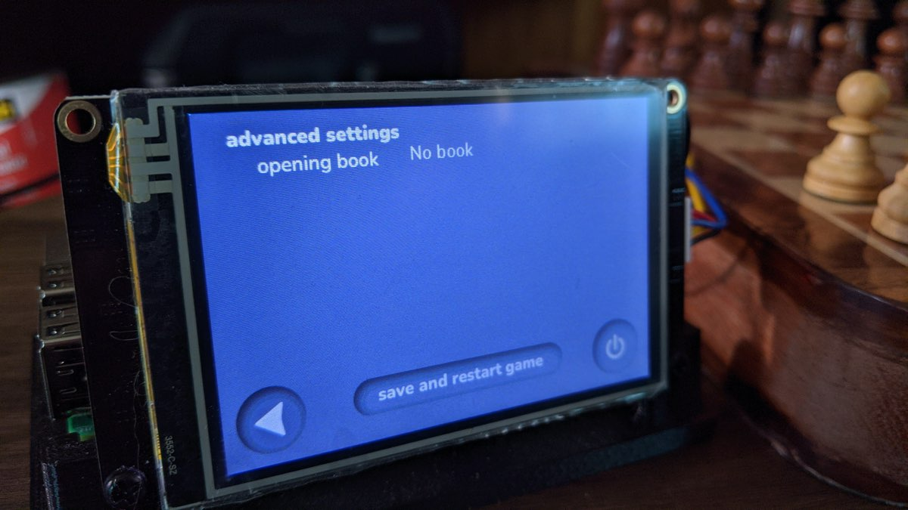
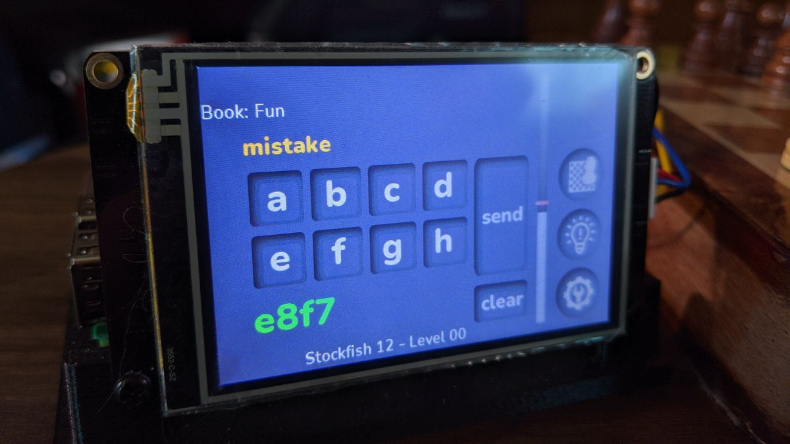
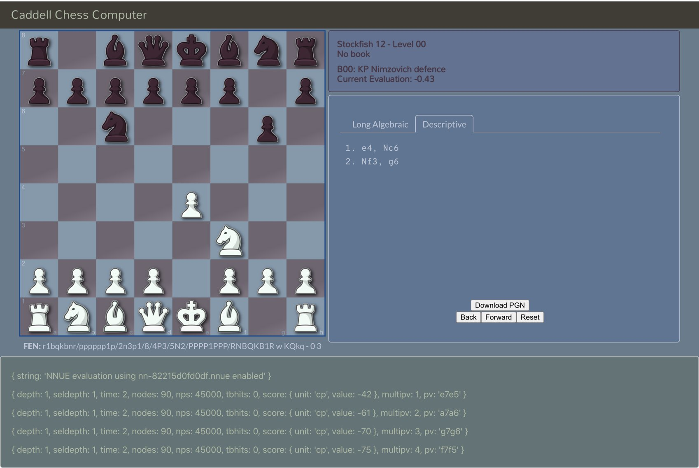

## Caddell Chess Computer

Caddell, a stand alone chess computer, was birthed from the desire to play against the Rodent chess
engine and its personality files, without using a computer or smartphone (and thus without the
potential for distraction that those devices can bring). Caddell is for playing chess OTB (Over The Board)
against a computer opponent. No special board or pieces are required... moves are inputted to the computer on its 3.5"
touchscreen using long algebraic notation while you move the pieces manually on your physical board. Caddell might be
compared to the [Chess Challenger 7](https://www.schach-computer.info/wiki/index.php/Fidelity_Chess_Challenger_7) from
decades ago, I know I thought of my long lost Chess Challenger often while working on Caddell.

The Caddell Chess Computer can theoretically utilize any chess engine that supports the UCI protocol and that has been
ported to the Raspberry Pi platform, and/or can be compiled for it. To date [Stockfish 12](https://stockfishchess.org/)
and [Rodent IV](http://www.pkoziol.cal24.pl/rodent/rodent.htm) have undergone the most compatibility testing.

### Built With

* [Raspberry Pi 3 model B+](https://www.raspberrypi.org/products/raspberry-pi-3-model-b-plus/)
* [Nextion touchscreen display](https://nextion.tech/)
* [Javascript](https://www.javascript.com/)
* [Redux](https://redux.js.org/)
* A handful of [npm packages](https://www.npmjs.com/)

Caddell isn't meant to be a copy or a rewrite of any of the fantastic projects that already exist. I hope
it fills a hole (no matter how small) and can stand on its own merits. Choosing Javascript as the
programming language further emphasizes the individuality of this project.

### NOW INCLUDES...

Due to their recent availability, the Caddell Chess Computer now includes _both_ **Stockfish 13** and the **Maia**
chess engines! Many thanks to [Al 'Scally' Cooper](https://github.com/ScallyBag) for compiling those for the picochess
community.

#### A Little Brief Terminology

<dl>
  <dt>Chess GUI</dt>
  <dd>The Caddell Chess Computer is a <em>Chess GUI</em> and relies upon <em>Chess Engines</em> to be fully operational. A Chess
  GUI (like Caddell) is the interface between the human player and the computer program that has all the smarts
  to play challenging chess. A Chess GUI lets you choose black or white, lets you select the engine and the strength
  of the engine. A Chess GUI should be responsible for knowing if your move is valid, for reporting check or mate, etc...</dd>

  <dt style="margin-top:20px">Chess Engine</dt>
  <dd>A <em>Chess Engine</em> generally isn't thought to have a human usable interface, and instead relies upon a
  <em>Chess GUI</em> for play. The Chess Engine knows the rules of chess and can make the best (or so, depending on
  a variety of factors like engine level, opening book, etc) move for any given board position. Caddell is <strong>not</strong>
  a chess engine and cannot determine a best move to play.</dd>

  <dt style="margin-top:20px">Personality [files]</dt>
  <dd>Some <em>Chess Engines</em> have an option to use a <em>Personality File</em>, optionally in addition to setting
  a strength level. A personality defines the <em>style</em> of play... perhaps one personality favors keeping all
  pawns, while another might stress pawn trades very early in the game. Personality files can make an engine seem more
  human-like in its play.</dd>

  <dt style="margin-top:20px">Opening Book(s)</dt>
  <dd>The Caddell Chess Computer allows you to select from a number of <em>Opening Books</em> to play against. The way
  Caddell uses this feature is to play moves from the opening book, bypassing the chess engine, for as long as lines
  of play continue to exist in the book. Books exist that favor semi-open, or Indian, or even "fun" openings. Using one
  of these books can guarantee that you play against an opening you are learning, or just to add some novelty to your
  play.</dd>
</dl>

### Getting Started

To get a local copy up and running you will need a Raspberry Pi board, the RPi 3 model B+ was used
during the creation of Caddell and therefore is known to work. You will also need to acquire a
Nextion 3.5" display (available on Amazon, banggood, and other online retailers). The basic and
enhanced version of the Nextion display both work fine. The "Intelligent" series was not tested.

### Usage

The following photos intend to give a little more info about the project as well as to begin to instruct on how
to use the Caddell Chess Computer.

This is the main playing screen of Caddell, where you'll spend most of your time. Moves are entered in long algebraic
notation using the two rows of buttons, labeled A-H. When the letter for the square is tapped the buttons switch to
numerics, 1-8, and then back again to letters when a number is tapped. This conserves screen real estate without
impeding the ability to enter moves.

On this screen you can see the opening that Caddell has determined for this game. Below the opening name you can see
that this game is using an opening book called "Fun". At the bottom of the screen lists the engine and level (and
personality if supported by the engine).

We can also see that Caddell believes your last move followed the opening precisely. The vertical bar shows Caddell's
idea of who has advantage.

The buttons on the right side of the screen show the current board position, a hint, and settings, from top to bottom.

This screen is reached by tapping the "show board" button on the main page. It shows the current position and the
pieces that have been removed from the game. Moves can not be made from this page... the value of this screen is
realized when a cat knocks your physical pieces to the floor.

Here we see the settings page. You can choose color, engine, and level on this screen, all by tapping on the item
you want to change. In the case of engine and level a "drop down" list is displayed that you can scroll through and
choose your desired item. If an engine has personalities they can be chosen from the next screen, reached by hitting
the right arrow.

This is the second settings page. This page allows you to choose an opening book, and if the engine from the prior
page supports personalities you will be given the chance to choose one here.

_Worth noting:_ Caddell supports choosing **both** a level and a personality for the Rodent IV engine.

Caddell is judging you while you play and will let you know if you've made a mistake, a blunder, or by some chance a
spectacular move.

### Browser

Only a limited functionality beta feature for now, Caddell also has a browser component. The browser component is meant
to compliment the stand alone chess computer and not to replace any of its features or functionality. An enjoyable game
will always be able to be played without using a browser at all.

Some of what the browser component currently offers includes:

- seeing a large view of the board position (larger than on the 3.5" screen), for replacing pieces when a cat knocks
your board over or a dog's tail swipes the pieces away
- ability to step backwards and forward moves in the game... it doesn't change the state of the game, it just allows
you to view the history
- view the move history in either long algebraic or descriptive notation
- ability to see the engine's _info_ responses
- ability to download the PGN of the game
- ability to copy the FEN of the current position (including having stepped backward through history)
- set parameters (color, engine, level, etc) of a game and start it

Partial Future Browser Features Planned

- read info about engines, pesonalities, and books
- set more options for the engine than are exposed on the stand alone device

### Seeing It All Work

A brief movie showing the first couple of moves of a game. Initially the focus is on the stand alone
Caddell device and then switches to the browser in the background.

### Download

The source for the Caddell Chess Computer is hosted on github at
[http://github.com/caddellchess/caddell-chess](http://github.com/caddellchess/caddell-chess). Installation advice can
be found in the [README](http://github.com/caddellchess/caddell-chess/blob/main/README.md) and additional files.

### License

Distributed under the GNU General Public License v3.0 or later.

### Acknowledgements

Although the Caddell Chess Computer is a stand alone work, this idea was inspired by the successful
[picochess](http://docs.picochess.org/en/latest/) by locutusofpenguin. Features, and priority of them, were influenced
by picochess, and in some cases even directory structure. No code was borrowed from picochess, and in fact different
technologies were used to create Caddell (Javascript vs Python, and as a result even otherwise very useful Python
packages were not [able to be] used).

The Caddell Chess Computer could not have been possible without the prior good works by several others. In the
npm registry exists a few helper packages to make dealing with chess logic easier. The specific packages used can
be found in this project's package.json file.

Sincere thanks to the [StingRay Chess GUI project](http://www.stingraychess.org/). The look and feel of their GUI is
very seducing and so for now the Caddell Chess Computer is leaning on it until Caddell grows a unique look of its own.
No code, including no CSS, was lifted from StingRay. Caddell's browser component was handcrafted from scratch.

And last but far from least, a huge debt of gratitude is due to the chess engines that are readily available. Caddell
would be at best a proof-of-concept project only without a chess engine to actually play a game against.

### Disclaimer

Open source projects are made available and contributed to under licenses that include terms that, for the protection
of contributors, make clear that the projects are offered “as-is”, without warranty, and disclaiming liability for
damages resulting from using the projects. This project is no different. The open content license it is offered under
includes such terms.

Running an open source project, like any human endeavor, involves uncertainty and trade-offs. We hope this project
helps you, but it may include mistakes, and can’t address every situation. If you have any questions about your use of
it, we encourage you to do your own research, seek out experts, and discuss with your community.

_text borrowed from [the open source guide legal disclaimer page](https://opensource.guide/notices/) ._
